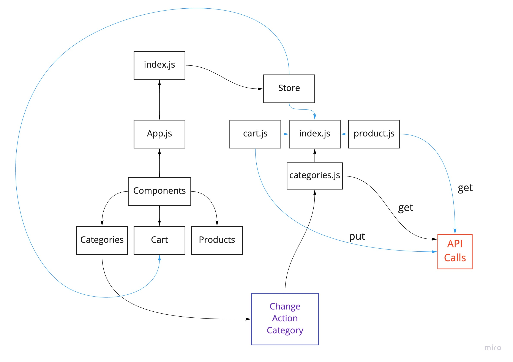

# Storefront

## Version 
*0.1.0*

**Author**: ***Waleed A. Afifi***


**Virtual Store Phase 3**: Connect the Virtual Store to an API to retrieve live data from your data source, using `thunk` to enable asynchronous actions


- As a user, I want to interact with live inventory so that I have confidence that the displayed products are in stock
- As a user, I want to know to that when I add an item to my cart, that it is removed from inventory so that no other users can purchase it


## Clone and run
```
    git clone https://github.com/waleedafifi-401-advanced-javascript/storefront.git
    
    npm install

    npm start
```

#### UML
