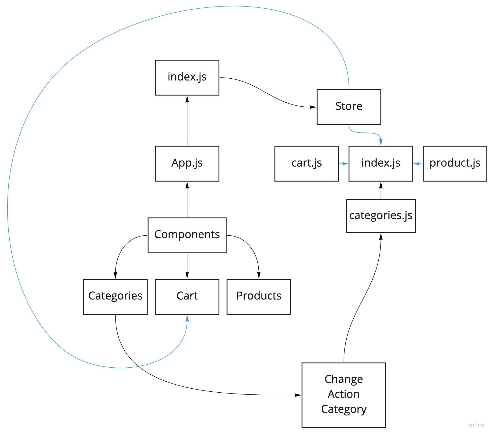

# Storefront

## Version 
*0.1.0*

**Author**: ***Waleed A. Afifi***


**Virtual Store Phase 1**: For this assignment, you will be starting the process of creating an e-Commerce storefront using React with Redux, coupled with your live API server

- As a user, I expect to see a list of available product categories in the store so that I can easily browse products
- As a user, I want to choose a category and see a list of all available products matching that category
- As a user, I want a clean, easy to use user interface so that I can shop the online store with confidence

## Clone and run
```
    git clone https://github.com/waleedafifi-401-advanced-javascript/storefront.git
    
    npm install

    npm start
```

#### UML
